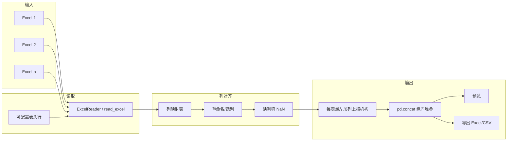

# 多运营商 Excel 表合并方案

## 一、标准列名（51 列）

合并目标表头（与入库/evdata 对齐，含经度、纬度、经纬度标准）：

```
序号、充电桩编号、充电桩内部编号、省份、城市、区县、经度、纬度、经纬度标准、
充电桩类型、充电桩所属区域分类、所属充电站编号、充电站内部编号、充电站名称、充电站位置、
充电站投入使用时间、充电站所处道路属性、充电站联系电话、充电桩所属运营商、电表号、
充电桩厂商编号、充电桩型号、充电桩属性、充电桩生产日期、服务时间、桩型号是否获得联盟标识授权、
支付方式、设备开通时间、额定电压上限、额定电压下限、额定电流上限、额定电流下限、额定功率、
接口数量、接口1标准、接口2标准、接口3标准、接口4标准、备注、
省份_中文、城市_中文、区县_中文、充电桩类型_转换、充电桩属性_转换、充电桩所属运营商_转换、
充电桩厂商编号_转换、入库时间、运营商名称、充电桩内部编号_运营商名称
```

---

## 二、样例表情况汇总

| 序号 | 文件名（运营商） | 表头行 | 列数 | 说明 |
|------|------------------|--------|------|------|
| 1 | 车电网 | 第 0 行 | 47 | 表头多为「说明型」长文本，需按**位置或末尾短名**映射到标准列 |
| 2 | 亨通慧充 | — | 0 | 第 0 行非表头，需**可配置表头行**（如 1 或 2） |
| 3 | 嘉兴智行 | 第 0 行 | 38 | **列名与标准基本一致**，缺：序号、*_中文、*_转换、入库时间、运营商名称等 |
| 4 | 广州蔚景 | 第 0 行 | 35 | 部分同义不同名：编码↔编号、运营商机构代码↔充电桩所属运营商；仅 1 个「接口标准」 |
| 5 | 杭州好充 | — | 0 | 同亨通，表头不在第 0 行 |
| 6 | 极氪 | — | 0 | 表头不在第 0 行 |
| 7 | 湖南京能 | 第 0 行 | 11 | 多为 Unnamed，表头可能在下一行或需按**固定列序**映射 |

结论：需要支持**可配置表头行**、**列名映射**（含同义不同名）、部分表需**按列位置**映射。

---

## 三、表头行判定规则（单 Sheet 或仅一个有内容的 Sheet）

**适用**：单 Sheet 文件，或多 Sheet 但**仅一个 Sheet 有内容**（有内容的取第一个，其余忽略）。表头判定在该 Sheet 上进行，规则如下（0-based）。（「有内容」可约定为：该 Sheet 至少有一行非空单元格，或行数/列数超过设定阈值。）

| 条件 | 表头行 |
|------|--------|
| **前 3 行（行 0、1、2）内**存在某行**包含**「充电桩编号」 | **表头行 = 第一个包含「充电桩编号」的行**（0-based）；若该行上一行含「单位」「参考」「编码方法」之一，仍以该行为表头，数据从表头下一行起读 |
| 前 3 行均不包含「充电桩编号」 | **不处理该表**，报错：`「{表名称}」由于无法确定表头暂未合并` |

**说明：**

- 「包含」指该行任意单元格的字符串中出现该关键词（如「参考1.11编码方法…」即包含「参考」和「编码方法」）。
- 第一行包含「单位/参考/编码方法」时，**仅当第二行包含「充电桩编号」**才认定表头为第二行；若第二行不包含「充电桩编号」，则视为无法确定表头，报错。
- **表名称**：用于报错文案，建议用**工作表名（Sheet 名）**；若需更易识别，可用「文件名 + Sheet 名」或仅文件名，实现时二选一即可。

**伪代码：**

```
rows = 读取前 3 行（行 0、1、2）
for i in 0..2:
    若 rows[i] 包含("充电桩编号"):
        header_row = i
        返回
报错 "「{表名称}」由于无法确定表头暂未合并"，跳过该表
```

### 三.2 多 Sheet 时的处理（一般 3 个 Sheet）

当文件中**有多个 Sheet** 且其中存在**名称或内容中含有「1.1」的 Sheet** 时，按多 Sheet 逻辑处理：

- **主表**：**含有「1.1」的 Sheet** 为要参与合并的主表（充电桩明细），表头行判定规则与上文**三**一致（第一行是否含「单位/参考/编码方法」→ 看第二行是否含「充电桩编号」等）。
- **Sheet 1.2（运营商字典）**：用于补全主表缺失的「运营商名称」「运营商类型」。  
  - 若主表（1.1）**没有「运营商名称」字段**，则在合并前对主表做一次补全：  
  - 用 1.1 的 **「充电桩所属运营商」** 与 1.2 的 **「运营商编号」** 匹配；  
  - 从 1.2 取 **「运营商名称」「运营商类型」** 填回 1.1（即合并前在 1.1 上新增这两列）。
- **Sheet 1.3（厂商字典）**：用于补全主表缺失的「充电桩生产厂商名称」「充电桩生产厂商类型」。  
  - 用 1.1 的 **「充电桩厂商编号」** 与 1.3 的 **「充电桩生产厂商编号」** 匹配；  
  - 从 1.3 取 **「充电桩生产厂商名称」「充电桩生产厂商类型」** 填回 1.1（即合并前在 1.1 上新增这两列）。

**汇总**：多 Sheet 时，先识别含 1.1 的 Sheet 作为主表并判定表头行；若主表无「运营商名称」，则用 1.2 匹配补全「运营商名称」「运营商类型」；用 1.3 匹配补全「充电桩生产厂商名称」「充电桩生产厂商类型」。补全后再参与与其他文件的纵向合并。

| 匹配关系 | 主表（1.1）字段 | 字典表 | 字典表匹配列 | 取回并新增到 1.1 的列 |
|----------|------------------|--------|--------------|------------------------|
| 运营商   | 充电桩所属运营商 | 1.2    | 运营商编号   | 运营商名称、运营商类型 |
| 厂商     | 充电桩厂商编号   | 1.3    | 充电桩生产厂商编号 | 充电桩生产厂商名称、充电桩生产厂商类型 |

---

## 四、合并与「上报机构」列

每个表按前述规则（表头判定、多 Sheet 时 1.2/1.3 补全）处理完成后，**按统一表头纵向合并**。合并时在**最左侧**增加一列：**「上报机构」**，用**表名称**填充。

**表名称清洗规则**（填充「上报机构」时，对表名称做以下剔除，再写入）：

- 去掉前缀：**「202512_公共桩_」**
- 去掉：**「_公共桩」**（该字段时间在文件名/表名中出现的段）
- 去掉：**「附件一：」及其后面的全部内容**（即从「附件一：」起至末尾都删除）

示例：

| 原始表名称（例） | 清洗后「上报机构」 |
|------------------|---------------------|
| 202512_公共桩_嘉兴智行物联网技术有限公司_公共桩.xlsx | 嘉兴智行物联网技术有限公司 |
| 202512_公共桩_深圳市车电网络有限公司_附件一：充电基础设施备案信息表-总数-2025-12(车电网).xlsx | 深圳市车电网络有限公司 |

实现时：先对文件名（或 Sheet 名，视「表名称」约定）做上述三段剔除与截断，得到清洗后的字符串，再填入该表所有行的「上报机构」列；合并时该列置于最左。

---

## 五、合并流程（总体）



---

## 六、列映射策略

### 6.1 映射方式

- **方式 A：按列名映射**  
  配置「源列名 → 标准列名」。若某文件列名与标准一致或存在已知同义名，直接使用该映射。
- **方式 B：按列位置映射**  
  对「表头为 Unnamed 或说明型」的表，配置「标准列名 → 列索引（0-based）」；读表后按索引取列再重命名为标准列名。
- **方式 C：混合**  
  先尝试按列名映射，未匹配到的标准列再按「该运营商模板」的位置映射（若已配置）。

### 6.2 各运营商建议映射（基于当前样例）

**嘉兴智行**  
- 列名已与标准一致（除缺少的列），映射表可为「 identity + 补缺列」：  
  - 源列名即标准列名，无需改名；  
  - 缺列：序号、经度、纬度（若该表无）、省份_中文、城市_中文、区县_中文、*_转换、入库时间、运营商名称、充电桩内部编号_运营商名称 → 填空。

**广州蔚景**  
- 充电桩编码 → 充电桩编号  
- 充电桩内部编码 → 充电桩内部编号  
- 充电站编码 → 所属充电站编号  
- 充电站内部编码 → 充电站内部编号  
- 运营商机构代码 → 充电桩所属运营商  
- 接口标准 → 接口1标准（或按规则拆到 1~4）；接口2~4 标准填空  

**车电网**  
- 表头为长说明，建议按**列位置**建模板：  
  - 用「标准列名 → 列索引」配置（需根据实际 47 列顺序逐列核对一次）；  
  - 或保留其最后若干列短名（如「充电桩类型」「充电桩属性」「支付方式」等）做列名映射，其余按位置。

**亨通 / 杭州好充 / 极氪**  
- 先支持「表头行」可配置（如 1 或 2），再读表；  
- 若读出的列名仍与标准不一致，再为该运营商配置列名或位置映射。

**湖南京能**  
- 若确认表头在下一行：表头行设为 1 再读；  
- 若仍为 Unnamed：按「标准列名 → 列索引」做位置映射（需根据实际表结构核对）。

---

## 七、实现要点

### 7.1 配置

- **标准列名列表**：写死为 51 列的 list，与本文「一」一致。  
- **表头行**：默认 0，支持 per-file 或 per-operator 指定（如 0/1/2）。  
- **列映射**：  
  - 存为「运营商/文件名识别键 → 映射配置」；  
  - 映射配置 = 字典：`标准列名 -> 源列名或源列索引`；  
  - 若为源列名且存在则 rename，若为索引则按 iloc 取列；缺失标准列填 NaN。

### 7.2 读取

- 使用现有 `ExcelReader.read(header=表头行)` 或 `pd.read_excel(..., header=表头行)`。  
- 若某文件 `header=0` 读得列数为 0，可提示「表头可能不在第一行」并支持用户选择表头行后重试。

### 7.3 对齐与合并

1. 对每个 DataFrame：根据该文件/运营商对应的映射配置，得到「仅含标准列、列序一致」的 DataFrame（缺列填 NaN）。  
2. **在每个表合并前**：在最左侧添加列「上报机构」，取值 = 对该表的表名称按**四**的规则清洗（去掉「202512_公共桩_」「_公共桩」及「附件一：」及其后内容）。  
3. `pd.concat([df1, df2, ...], ignore_index=True)` 纵向堆叠。  
4. 可选：在合并后的表上再增加「来源文件名」列，便于追溯。

### 7.4 入口与交互（data_manager 新 Tab）

- 多文件上传 → 选择表头行（或「自动尝试 0/1/2」）→ 预览每个文件表头。  
- 列映射：  
  - 若某文件列名与标准一致或已配置映射，自动对齐；  
  - 否则提供「标准列 → 下拉选择该文件列名」或「按列索引映射」的简单配置 UI，并支持保存为模板（按文件名关键字或运营商名）。  
- 执行合并 → 预览合并结果 → 导出 Excel/CSV。

### 7.5 表头行为 0 的 3 个文件

- 亨通、杭州好充、极氪：建议在页面上提供「表头行」选择（0/1/2），用户选 1 或 2 后重新解析；或实现「自动检测」：从第 0 行起逐行尝试作为 header，取第一个「非空列数 ≥ 标准列数一半」的行作为表头行。

---

## 八、后续可做

- 合并前/后做简单清洗（去重、必填列校验、日期格式统一）。  
- 合并结果一键走现有「数据导入」入库。  
- 将「标准列名 + 各运营商映射表」持久化到 JSON/DB，供下次同运营商文件复用。
