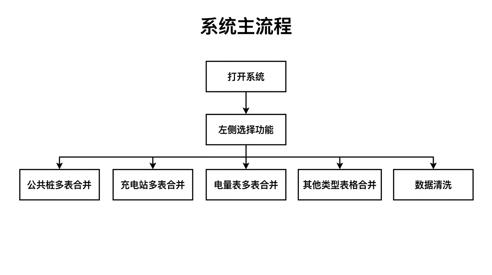
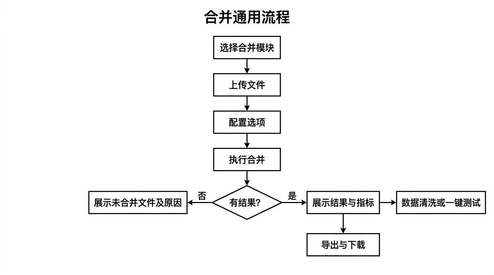
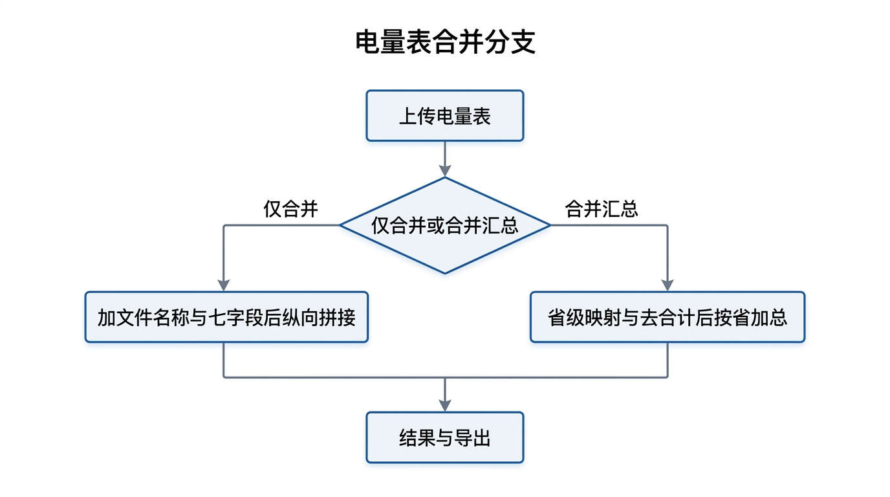
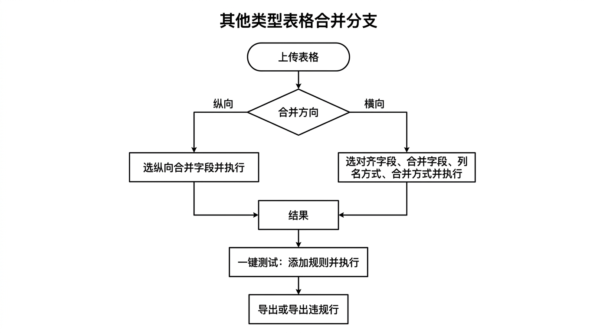
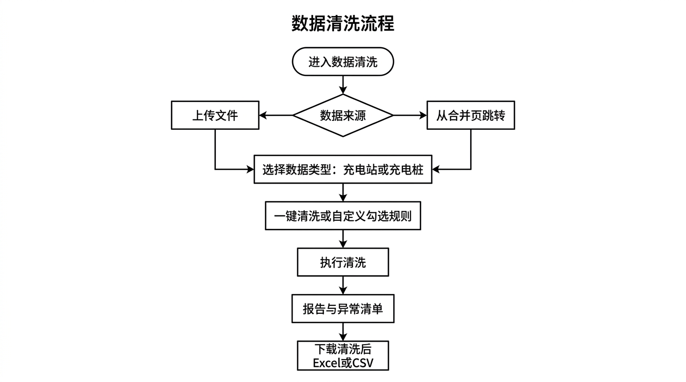

# 众链充电原始表合并系统 — 产品开发文档

本文档描述「众链充电原始表合并系统」（Merge）的产品功能、规则依据、使用说明、适用场景及业务流程图，供产品、开发与运维参考。

---

## 一、产品概述

本系统为**独立网页应用**，用于对充电业务相关多表（公共桩、充电站、电量表等）及通用表格进行**合并、汇总与清洗**，支持 Excel（.xlsx/.xls）与 CSV，**无需数据库与登录**。用户通过左侧功能入口选择模块，上传文件并完成配置后，可预览结果并导出 Excel/CSV。

---

## 二、产品功能

### 2.1 功能模块总览

| 模块 | 说明 |
|------|------|
| **公共桩多表合并** | 多运营商公共桩 Excel/CSV 按统一表头识别，纵向合并，首列填充「上报机构」；支持小文件预览导出与大文件直接合并为 CSV。 |
| **充电站多表合并** | 多充电站表按统一表头识别，纵向合并，首列填充「上报机构」；支持小文件/大文件模式。 |
| **电量表多表合并** | 多电量表按「省级行政区域名称/月度充电电量」识别表头，支持**仅合并**（纵向拼接）与**合并汇总**（按省加总）；自动补「文件名称」「运营商名称」及七项电量字段。 |
| **合并汇总其他类型表格** | 通用多表合并：支持**纵向**（按选定字段拼接+表名称列）与**横向**（按对齐字段对齐后新增列）；可选表名称/表名称去重、仅合并或合并+汇总；提供**一键测试**（字段间加减乘除与大小关系校验）。 |
| **数据清洗** | 对充电站/充电桩表或合并结果执行标准化：空值、**主键 uid**（复合字段哈希）、序号（从 1 递增，仅作行号）、位置截断、日期统一为 yyyy-mm-dd、功率/电压/电流单位换算、充电站内部编号校验、设备类型标准化、设备开通时间校验等。 |

### 2.2 功能要点摘要

- **公共桩/充电站**：表头含特定关键词（如充电桩编号、充电站编码），多 Sheet 有 1.1/主表规则，合并后最左侧为「上报机构」（由文件名清洗）。
- **电量表**：表头含「省级行政区域名称」或「月度充电电量」；Sheet 选择规则（有内容、sheet1 优先、日期取最新）；七项电量字段按比例/绝对值规则计算；合并汇总前省级名称映射、排除合计/总计行；数值清洗（去 KWh、-、/ 等）。
- **其他类型表格**：首行为表头；纵向=表名称+选中字段纵向拼接；横向=按对齐字段对齐，各表选中字段以新列追加，列名可为表名称或去重后差异部分；可选合并+汇总（数值列按行求和）；一键测试可配置多规则并导出违规行。
- **数据清洗**：先选数据类型（充电站/充电桩），再一键清洗或自定义勾选规则；主键为 **uid**（充电站：充电站内部编号+充电站名称；充电桩：充电桩编号+所属充电站编号+充电站内部编号，拼接后 MD5），序号从 1 递增仅作行号；日期统一为 yyyy-mm-dd，适用列含「时间」「日期」等且排除「服务时间」；支持导出清洗后 Excel/CSV 及报告指标。

---

## 三、相关规则

各模块的详细规则以独立规则文档为准，开发与验收须符合对应文档。

| 模块/功能 | 规则文档 | 要点 |
|-----------|----------|------|
| 公共桩多表合并 | 《表格合并规则》 | 表头判定（充电桩编号/编码）、多 Sheet（1.1 为主表）、1.3 厂商补全、上报机构由文件名清洗。 |
| 充电站多表合并 | 《表格合并规则》 | 表头判定（充电站编号/编码）、多 Sheet（1.1→含充电站）、上报机构同上。 |
| 电量表多表合并 | 《电量表合并规则》 | Sheet 选择、表头（省级行政区域名称/月度充电电量）、仅合并/合并汇总、七字段取值与空值填 0、省级映射与排除合计总计、数值清洗（去单位与空值字符）。 |
| 其他类型表格合并 | 《其他类型表格合并规则》 | 纵向/横向、新增列名称（表名称/表名称去重）、纵向合并字段、横向对齐字段与横向合并字段、仅合并/合并+汇总。 |
| 一键测试 | 《其他类型表格-一键测试方案》 | 字段间加减乘除与大小关系、规则配置、执行校验、违规行展示与导出。 |
| 数据清洗 | 《数据清洗规则》 | 通用规则（空值、**主键 uid** 复合字段哈希、序号仅作行号、位置）、日期 yyyy-mm-dd 适用列与排除「服务时间」、单位换算、充电站/充电桩专项及报告指标。 |

规范类文档还可参考《数据格式与入库规范说明》。

---

## 四、使用说明

### 4.1 运行与入口

1. **运行**：在 `merge_app` 目录下执行 `streamlit run app.py`，或使用「双击运行 Merge.bat」/打包后的 exe。
2. **入口**：浏览器打开后，在**左侧边栏**选择功能：公共桩多表合并、充电站多表合并、电量表多表合并、合并汇总其他类型表格、数据清洗。

### 4.2 公共桩 / 充电站多表合并

1. 选择「公共桩多表合并」或「充电站多表合并」。
2. 选择合并模式：**小文件**（页面预览+导出 Excel/CSV）或**大文件**（直接合并为 CSV 下载）。
3. 点击「选择要合并的 Excel 或 CSV 文件」，多选文件后点击「开始合并」。
4. 查看合并结果（行数、成功数、未合并文件及原因）；小文件可预览前 10 行、导出 Excel/CSV，并可跳转「数据清洗」。

### 4.3 电量表多表合并

1. 选择「电量表多表合并」。
2. 上传多个电量表 Excel/CSV。
3. 点击「仅合并」或「合并汇总」：
   - **仅合并**：每表增加「文件名称」「运营商名称」及七项电量字段后纵向拼接。
   - **合并汇总**：同上后按「省级行政区域名称」映射并排除合计/总计行，再按省加总。
4. 在「导出」前可修改「导出文件名」，再下载 Excel 或 CSV；未合并文件及原因在下方表格中查看。

### 4.4 合并汇总其他类型表格

1. 选择「合并汇总其他类型表格」。
2. 上传多张表（Excel/CSV，首行为表头）。
3. 选择**合并方向**：
   - **纵向**：勾选「纵向合并字段」，点击「执行合并」；结果为首列「表名称」+ 所选字段纵向拼接。
   - **横向**：选择「新增列名称」（表名称/表名称去重）、「横向对齐字段」、「横向合并字段」、「合并方式」（仅合并/合并+汇总），点击「执行合并」。
4. **一键测试**（在导出前）：在「添加一条测试规则」中配置左侧字段与运算符、关系、右侧字段或常数，添加多条后可点击「一键测试」；查看通过/不通过及违规行，可「导出违规行 Excel」。
5. 在「导出」处修改文件名（可选）后下载 Excel 或 CSV。

### 4.5 数据清洗

1. 选择「数据清洗」。
2. **方式一**：上传一张待清洗的 Excel/CSV，上传后进入清洗页。
3. **方式二**：在公共桩/充电站合并结果页点击「数据清洗」，使用当前合并结果作为待清洗表。
4. 选择**数据类型**：充电站数据 或 充电桩数据。
5. 执行**一键清洗**或**自定义清洗**（勾选要执行的规则后点击「执行自定义清洗」）。
6. 查看清洗结果（成功数、失败数、各专项统计及异常清单）、预览与报告；修改「导出文件名」后下载「下载清洗后 Excel」或「下载清洗后 CSV」。

---

## 五、适用场景

| 场景 | 推荐模块 |
|------|----------|
| 多运营商公共桩表需要合并为一张表，便于入库或分析 | 公共桩多表合并 |
| 多充电站表需要合并为一张表 | 充电站多表合并 |
| 多省/多运营商电量表需要按省汇总或仅纵向拼接 | 电量表多表合并（仅合并 / 合并汇总） |
| 多张结构相近的通用表需要按行拼接或按某列横向对齐合并 | 合并汇总其他类型表格（纵向 / 横向） |
| 合并或原始表需统一日期格式、单位与缺失校验后再入库 | 数据清洗 |
| 合并结果需校验字段间关系（如 A+B=C、汇总>0） | 合并汇总其他类型表格 → 一键测试 |

---

## 六、业务流程图

以下流程图以图片形式呈现，便于直观理解各模块的入口与步骤，不含任何代码表述。

### 6.1 系统主流程

从打开系统到在左侧选择功能，可进入五大模块之一：公共桩多表合并、充电站多表合并、电量表多表合并、其他类型表格合并、数据清洗。

### 6.2 合并通用流程

选择合并类模块后，依次完成上传文件、配置选项、执行合并；有结果则展示指标并可导出，无结果则展示未合并文件及原因；部分模块支持从结果页进入数据清洗或一键测试。

### 6.3 电量表合并分支

上传电量表后，可选择仅合并（加文件名称与七字段后纵向拼接）或合并汇总（省级映射与去合计后按省加总），最终得到结果并导出。

### 6.4 其他类型表格合并分支

上传表格后按合并方向：纵向则选择纵向合并字段并执行；横向则选择对齐字段、合并字段、列名方式与合并方式并执行。得到结果后可进行一键测试（添加规则并执行），再导出或导出违规行。

### 6.5 数据清洗流程

进入数据清洗后，数据来源可为上传文件或从合并页跳转；接着选择数据类型（充电站或充电桩），选择一键清洗或自定义勾选规则并执行，查看报告与异常清单后下载清洗后的表格。

---

## 七、文档与版本

- **规则文档**：`电量表合并规则.md`、`其他类型表格合并规则.md`、`其他类型表格-一键测试方案.md`、`数据清洗规则.md`、`表格合并规则.md`、`数据格式与入库规范说明.md`。
- **运行说明**：`README.md`（依赖、运行方式、支持格式）。
- 本文档版本可随功能迭代更新，以当前仓库为准。

---

*文档版本：初版*
